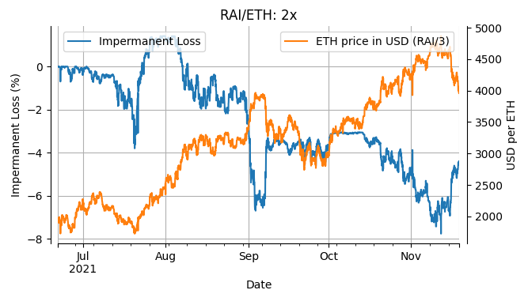
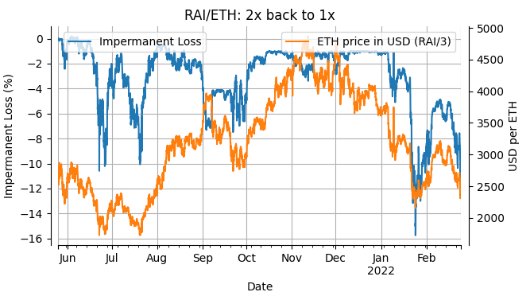
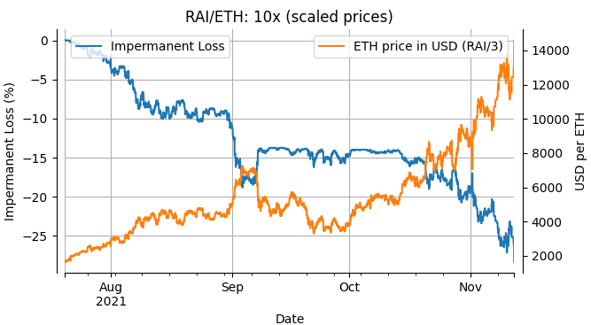
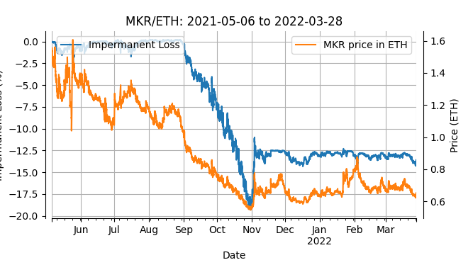

# ImpermanentLoss
Uniswap V3 impermanent loss simulations

## Background

How do we estimate the impermanent loss (IL) for a novel token on Uniswap v3?

This question is essential, for example, when deciding on how much of the token allocation to set aside to compensate liquidity providers for the IL they incur. Technically, the IL isn't a loss until the liquidity is removed, but on a DEX like Uniswap v3 with concentrated liquidity, active strategies with repeated "re-balancing" are required. Each time the position is re-balanced, the liquidity is removed, and thus the IL becomes a permanent loss.

Liquidity providers only earn trading fees when the token price is within the upper and lower bounds, bounds that were set when the liquidity was added. If the price moves outside of these bounds, no fees are earned. An active strategy, where the liquidity is removed and added again with new bounds, is necessary to keep earning fees. How often the liquidity should be re-balanced and what bounds to set depends on the volatility. Increases in volatility require re-balancing and wider bounds, while low volatility allows for infrequent re-balancing and narrow bounds. Since the IL is incurred each time the liquidity is removed, periods of high volatility imply greater incurred IL (i.e. permanent loss).

One approach to the estimate the IL is simulation. Simulation requires us to make some assumptions about the future conditions for our token.

## Assumptions and simulations
 * The volatility of the new token will be similar to existing tokens.
 * Liquidity providers, on average, try to minimize IL by following an active strategy where bounds are estimated using an auto-regressive model.

We simulate IL for the selected token pairs (see below) using [Gamma Strategy's](https://www.gammastrategies.org/) [Uniswap v3 Active Strategy Framework and Simulator](https://github.com/GammaStrategies/active-strategy-framework). The Active Strategy Framework and Simulator provides Python code for back-testing simulations of various active strategies, as well as code for implementing live strategies used by Gamma Strategies. We simulated using an [auto-regressive strategy](https://github.com/GammaStrategies/active-strategy-framework/blob/main/AutoRegressiveStrategy.py) with an AR(1)-GARCH(1,1) model. Specifically, for each token pair and period of interest, we simulated IL using 12 different settings for the parameters `alpha`, `tau` and `volume` (see, for example, the [auto-regressive strategy example](http://localhost:8888/notebooks/2_AutoRegressive_Strategy_Example.ipynb)), and selected the one with the lowest IL, assuming that the majority of liquidity on Uniswap v3 follows similar strategies.

The scripts for these simulations are available in the [IL repo](https://github.com/knasterk/ImpermanentLoss).

<!-- We can for example assume that the volatility of the new token will be similar to existing tokens and simulate the IL under -->
## Tokens
We are interested in estimating the future IL of a DAI or RAI-like stable coin (TOKS) and its corresponding governance token, TOKG (MKR or FLX-like). To estimate IL for the TOKS/TOKG pair, it would be best to use RAI/FLX or DAI/MKR. Unfortunately, the RAI/FLX pool only has 166 swaps and no trades after July 2021 - not enough for simulation. For DAI/MKR the liquidity data before 2021-10-23, is corrupt leaving us with only five months, severely limiting the scenarios that can be simulated. We are primarily interested in three specific scenarios. 1) A 2x increase of the governance token (TOKG) relative to the stable coin TOKS, 2) a 2x increase followed by a return to the previous levels, and 3) a 10x increase of TOKG relative to TOKS.

For 1) and 2), we select time periods with the appropriate price movements from the RAI/ETH pair, and for 3), we select a period where ETH 2.9x increased and scale that to 10x.

Thus, we focus our IL-simulations on the following pairs:

|   Future pair    | Simulation pair |
|------------------|-----------------|
|     TOKS/ETH      |      RAI/ETH    |
|    TOKS/TOKG      |      DAI/MKR    |  
|    TOKS/TOKG      |      RAI/ETH    |  
|    OCEAN/TOKG    |      MKR/ETH    |
<!-- |    TOKS/OCEAN     |      DAI/ETH    | -->

## How to run the script
The script `simulation_script.py` will run the simulations described below and generate the figures.
 * Clone [Gamma Strategy's](https://www.gammastrategies.org/) [Uniswap v3 Active Strategy Framework and Simulator](https://github.com/GammaStrategies/active-strategy-framework).
 * Place these scripts in the the resulting `active-strategy-framework` directory.
 * See [Uniswap v3 Active Strategy Framework and Simulator](https://github.com/GammaStrategies/active-strategy-framework).
 * Obtain a free API key from Bitquery.
 * Save the API key in a file in `config.py` in the `active-strategy-framework` directory with the variable name `BITQUERY_API_TOKEN` (eg. `BITQUERY_API_TOKEN = <api_key>`).
 * Make the directories `data`, `figs` and `results` in the `active-strategy-framework` directory.
 * Set the variable `DOWNLAD_DATA = True` in the `simulation_script.py`.
 * Run `simulation_script.py` (set `DOWNLAD_DATA = True` once the data is downloaded).

## Results

### DAI/MKR
To get a sense of what IL to expect in the future for the TOKS/TOKG pair, we simulated IL on historical data of the DAI/MKR pair. From the simulation, it is apparent that the IL increases (down to -12 %) during fast price changes (end of January 2022). However, for a new pair like TOKS/TOKG, it is reasonable to expect greater volatility than occurred during the 5-months periods in the DAI/MKR data.

<!--  -->

### RAI/ETH 2x
To simulate IL under a period of rapid price appreciation, we used historical data from the RAI/ETH pair. Specifically for a period from June to November 2021 when ETH doubled in price relative to RAI. RAI has a relatively stable price, close to 3 USD. In order to make the figure more readable, we transform the ETH price from RAI to USD by dividing it by 3. From this simulation, it is clear that the IL is most pronounced during periods of big increases in volatility, for example, at the end of July and the beginning of September 2021. This is likely due to the predictions that go into setting the liquidity bounds. Changes in volatility are hard to predict, and thus, the bounds are likely too narrow with a resulting increase in IL.

<!--  -->

### RAI/ETH volatility followed by a return to the initial price
On a "traditional" automated marker (AMM) without concentrated liquidity, price changes don't affect the realized IL (i.e. permanent loss) as long as the liquidity position is removed once the price is back to the same value as it was when the liquidity was added. However, on an AMM with concentrated liquidity, IL is incurred every time the liquidity bounds are changed (liquidity is removed and re-added with new bounds). To simulate this scenario, we selected a 9-month period where the ETH price went through an approximately 3x-change but returned to its initial price. From the figure, we can see that an -12% IL is incurred at the end of the period, but due to the active (predictive) strategy, most IL occurs during rapid price changes.

<!--  -->

### RAI/ETH 10x
To further explore how the magnitude of price increase influences the IL, we simulated a moonshot scenario -- a 10x increase in token price. Since we didn't find any relevant data with an actual 10x increase (😞), we had to generate semi-synthetic data. We selected a 4-month period where the ETH price increased 2.9x and scaled it to 10x. This strong price appreciation led to a 25% loss, something that might be acceptable in the face of a 10x increase.

<!--  -->

### MKR/ETH
Finally, we estimated future IL for the TOKG/OCEAN pair but simulating IL on historical data of the MRK/ETH pair. This simulation covers the longest time period (nearly a year) and a -2.9x drop in MKR price relative to ETH. The fast price depreciation is associated with a big increase in IL, followed by a period with a more stable price and correspondingly less IL.

<!--  -->

<!--
### RAI/ETH
 -->

## Conclusion
The IL on Uniswap v3 can easily be -10 to -20% under the scenarios we studied (down to -25% in the semi-artificial 10x scenario). Due to the concentrated liquidity, active strategies are critically important. These strategies attempt to predict the future price and volatility and set the liquidity bounds accordingly. However, these predictions often fail during periods of increased volatility, with a resulting increase in IL. For new projects having to decide on how much of the token allocation to set aside to compensate liquidity providers, realistic estimates of the future IL are crucial.
